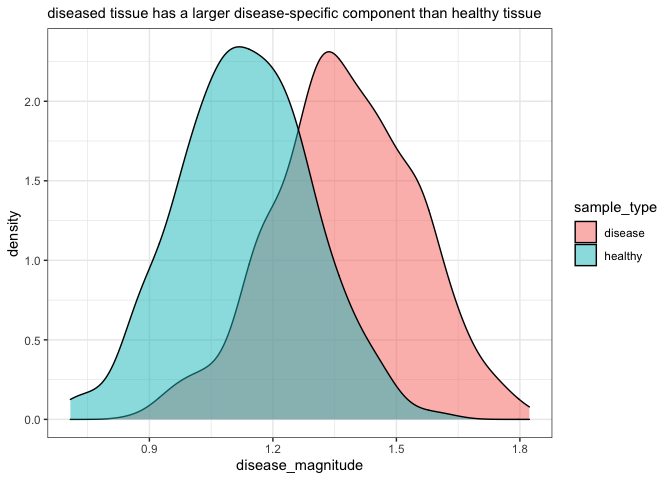

<!-- README.md is generated from README.Rmd. Please edit that file -->

# marx

<!-- badges: start -->
<!-- badges: end -->

`marx` is an R package that implements <u>Ma</u>trix factorization and
<u>R</u>esidual E<u>x</u>pression (MARX), an algorithm for comparing
high-dimensional biological measurements to a lower-dimensional
reference linear subspace. Currently, MARX is unpublished and highly
experimental.

## Installation

You can install the development version of marx from
[GitHub](https://github.com/) with:

``` r
# install.packages("devtools")
devtools::install_github("keyes-timothy/marx")
```

## Example

This is a basic example for using `marx` to decompose an input dataset
into two components: one that aligns with a reference dataset
(represented as a linear subspace) and one that doesn’t align with the
reference.

``` r
library(marx)

# simulate reference data 
# this data is assumed to be an expression matrix in which rows represent 
# observations and columns represent measurements (i.e. genes). 
healthy_data <-
  matrix(data = runif(n = 300 * 40), nrow = 300, ncol = 40) |>
  dplyr::as_tibble()
#> Warning: The `x` argument of `as_tibble.matrix()` must have unique column names if `.name_repair` is omitted as of tibble 2.0.0.
#> Using compatibility `.name_repair`.
#> This warning is displayed once every 8 hours.
#> Call `lifecycle::last_lifecycle_warnings()` to see where this warning was generated.

# simulate new data 
disease_data <- 
  matrix(data = runif(n = 700 * 40, min = 1, max = 2), nrow = 700, ncol = 40) |>
  dplyr::as_tibble()

# build a healthy reference subspace using the SVD
healthy_subspace <- 
  healthy_data |> 
  # other method options include "nmf" and "pma"
  marx_find_healthy_subspace(pca_threshold = 0.9, method = "svd")

# project the disease_data onto the healthy subspace
disease_projection <- 
  disease_data |> 
  marx_project(healthy_subspace = healthy_subspace)

head(disease_projection)
#> # A tibble: 6 × 80
#>   V1_lineage V2_lineage V3_lin…¹ V4_li…² V5_li…³ V6_li…⁴ V7_li…⁵ V8_li…⁶ V9_li…⁷
#>        <dbl>      <dbl>    <dbl>   <dbl>   <dbl>   <dbl>   <dbl>   <dbl>   <dbl>
#> 1       1.31       1.46     1.13    1.54    1.39    1.11    1.34    1.10    1.74
#> 2       1.57       1.30     1.50    1.35    1.52    1.61    1.43    1.65    1.74
#> 3       1.58       1.35     1.34    1.66    1.54    1.36    1.27    1.26    1.67
#> 4       1.25       1.16     1.62    1.56    1.50    1.54    1.30    1.51    1.57
#> 5       1.64       1.27     1.64    1.54    1.65    1.97    1.15    1.55    1.52
#> 6       1.88       1.48     1.67    1.27    1.80    1.55    1.36    1.49    1.84
#> # … with 71 more variables: V10_lineage <dbl>, V11_lineage <dbl>,
#> #   V12_lineage <dbl>, V13_lineage <dbl>, V14_lineage <dbl>, V15_lineage <dbl>,
#> #   V16_lineage <dbl>, V17_lineage <dbl>, V18_lineage <dbl>, V19_lineage <dbl>,
#> #   V20_lineage <dbl>, V21_lineage <dbl>, V22_lineage <dbl>, V23_lineage <dbl>,
#> #   V24_lineage <dbl>, V25_lineage <dbl>, V26_lineage <dbl>, V27_lineage <dbl>,
#> #   V28_lineage <dbl>, V29_lineage <dbl>, V30_lineage <dbl>, V31_lineage <dbl>,
#> #   V32_lineage <dbl>, V33_lineage <dbl>, V34_lineage <dbl>, …
#> # ℹ Use `colnames()` to see all variable names
```

marx can also compute the lineage- and disease-specific component
magnitudes (i.e. the reconstruction and the reconstruction loss for each
observation using the reference subspace):

``` r
disease_projection |> 
  marx_find_magnitudes() |> 
  head()
#> # A tibble: 6 × 3
#>   lineage_magnitude disease_magnitude total_magnitude
#>               <dbl>             <dbl>           <dbl>
#> 1              8.63              1.29            8.72
#> 2              9.52              1.26            9.60
#> 3              9.03              1.24            9.12
#> 4              9.84              1.49            9.95
#> 5              9.51              1.27            9.59
#> 6              9.62              1.36            9.72
```

We can compare the disease-specific component of the healthy data and
the disease data:

``` r
# find healthy projection
healthy_projection <- 
  healthy_data |> 
  marx_project(healthy_subspace = healthy_subspace)

# find healthy magnitudes 
healthy_magnitudes <- 
  healthy_projection |> 
  marx_find_magnitudes()

disease_magnitudes <- 
  disease_projection |> 
  marx_find_magnitudes()

plot_tibble <- 
  dplyr::bind_rows(
    dplyr::mutate(healthy_magnitudes, sample_type = "healthy"), 
    dplyr::mutate(disease_magnitudes, sample_type = "disease")
  )

plot_tibble |> 
  ggplot2::ggplot(ggplot2::aes(x = disease_magnitude, fill = sample_type)) + 
  ggplot2::geom_density(alpha = 0.5) + 
  ggplot2::theme_bw() + 
  ggplot2::labs(subtitle = "diseased tissue has a larger disease-specific component than healthy tissue")
```


